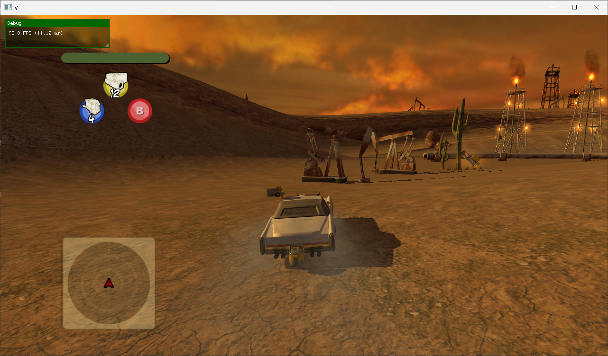
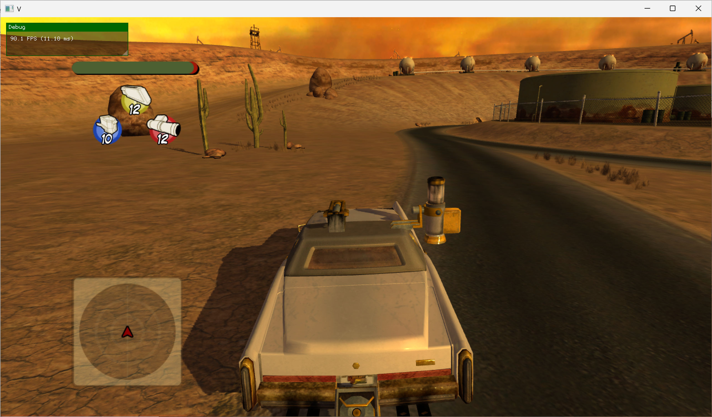
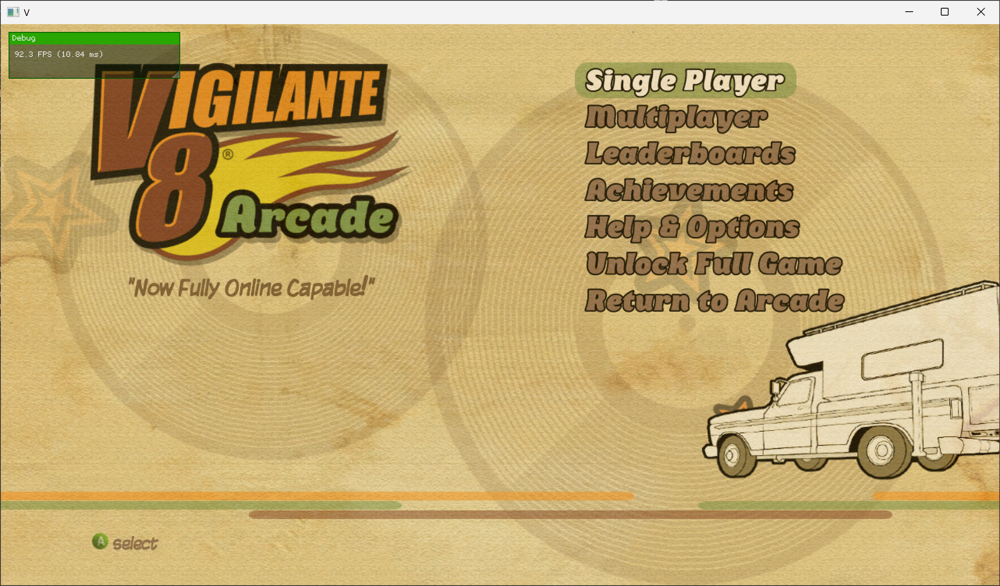

# Vigilante 8 Arcade - Static Recompilation

**Vigilante 8 Arcade** (Xbox 360 / XBLA) running natively on PC via static recompilation. No emulator. No interpreter. Just raw, recompiled C++ running at full speed.


*Full 3D gameplay at 90 FPS — vehicles, terrain, weapons, HUD, and sky all rendering via D3D12*


*Vehicular combat with weapon pickups, targeting, and particle effects*


*Main menu at 92 FPS*

## How It Works

Instead of emulating a PowerPC CPU instruction-by-instruction at runtime, this project translates the **entire Xbox 360 binary** into equivalent C++ source code ahead of time. The result: **1.8 million lines of generated C++** across 49 files that compile into a native x86-64 executable. The game logic runs at full speed because it IS native code — no JIT, no interpreter, no CPU emulation overhead.

The Xbox 360's Xenos GPU commands are processed by a D3D12 backend (derived from the [Xenia](https://github.com/xenia-project/xenia) emulator's GPU code), translating Xbox 360 shaders to PC shaders in real-time.

**Built with:**
- [XenonRecomp](https://github.com/hedge-dev/XenonRecomp) — PowerPC static recompiler by hedge-dev
- [ReXGlue SDK](https://github.com/hedge-dev/XenonRecomp) — Runtime SDK providing Xbox 360 kernel, GPU (D3D12), audio (XMA), and input emulation

## Current Status

**The game is playable.** It boots, navigates menus, loads levels, and runs full 3D gameplay at 90 FPS. Vehicles drive, weapons fire, enemies attack, audio plays, controllers work with rumble, and the full 3D world renders — terrain, sky, buildings, vehicles, particles, and HUD.

| What Works | Status |
|-----------|--------|
| Game boot & CRT initialization | Working |
| Menu navigation & UI | Working |
| Audio playback (XMA decode) | Working |
| Controller input + rumble | Working |
| HUD rendering (minimap, targeting, health) | Working |
| File I/O (38 game data files) | Working |
| Fiber-based cooperative threading (6 threads) | Working |
| GPU pipeline (D3D12, shader translation) | Working |
| 3D world rendering (terrain, vehicles, sky) | Working |
| Weapon effects & particles | Working |
| 79 shaders translated, 58+ pipelines | Working |
| ~2,800 draw calls / frame, 15 resolves / frame | Working |
| Multiplayer / networking | Stubbed (returns offline) |

## Quick Start

### Prerequisites
- **Windows 10/11** (D3D12 required)
- **CMake 3.25+**
- **Clang 18+** (MSVC frontend via clang-cl)
- **Ninja** build system
- A legally obtained copy of **Vigilante 8 Arcade** (Xbox 360 XBLA)

### Build

```bash
# 1. Clone
git clone https://github.com/sp00nznet/vig8.git
cd vig8

# 2. Place your extracted game files in extracted/
#    (default.xex + data/ directory with .ib/.ibz files)

# 3. Build the ReXGlue SDK (one-time setup)
cd tools/rexglue-sdk
cmake --preset win-amd64
cmake --build out/build/win-amd64 --config Release --target install
cd ../..

# 4. Run codegen (generates C++ from XEX binary)
tools/rexglue-sdk/out/install/win-amd64/bin/rexglue.exe codegen

# 5. Re-apply safe macro override in generated/vig8_init.h
#    (see PROGRESS.md for the PPC_CALL_INDIRECT_FUNC override)

# 6. Build the game
cd project
cmake --preset win-amd64
cmake --build out/build/win-amd64 --config Release
cd ..

# 7. Run (ROV render path required for correct 3D rendering)
project/out/build/win-amd64/Release/vig8.exe extracted/ --render_target_path_d3d12=rov
```

### Important: GPU Render Path

The game requires `--render_target_path_d3d12=rov` for correct 3D world rendering. The default RTV (Render Target View) path has an issue resolving the game's k_2_10_10_10_FLOAT render targets with 4xMSAA — the 3D scene resolves correctly but the intermediate textures appear white during compositing. The ROV (Rasterizer Ordered Views) path uses pixel shader interlock for EDRAM emulation and handles this correctly.

## Project Structure

```
vig8/
├── config/
│   ├── vig8_rexglue.toml          # ReXGlue codegen config (function overrides, switch tables)
│   ├── vig8.toml                  # Legacy XenonRecomp config
│   └── vig8_switch_tables.toml    # 81 jump table definitions
├── generated/                     # ReXGlue codegen output
│   ├── vig8_config.h              # Address constants (code base, image base)
│   ├── vig8_init.h/cpp            # Function table + safe macro overrides
│   └── vig8_recomp.*.cpp          # 17 recompiled source files (gitignored, ~60MB)
├── project/                       # CMake project
│   ├── CMakeLists.txt             # Build system (links rex::core/runtime/kernel/graphics/ui)
│   └── src/
│       ├── main.cpp               # Windowed app, VEH crash handlers, null page handler
│       ├── stubs.cpp              # Stub implementations for missing kernel APIs
│       └── test_boot.cpp          # Console test harness with crash diagnostics
├── src/
│   └── kernel_stubs.cpp           # Legacy kernel stubs (pre-ReXGlue, 205 functions)
├── tools/
│   ├── rexglue-sdk/               # ReXGlue SDK (gitignored, built locally)
│   ├── XenonRecomp/               # Patched XenonRecomp (gitignored)
│   ├── find_missing_vtable_funcs.py  # Vtable scanner for missing function entries
│   └── patches/                   # XenonRecomp source patches
├── extracted/                     # Game files (gitignored, copyrighted)
├── docs/                          # Technical documentation
├── gameplay.png                   # In-game screenshot (Oil Fields level)
├── gameplay2.png                  # In-game screenshot (combat)
├── screenshot.png                 # Main menu screenshot
├── PROGRESS.md                    # Detailed development log
└── README.md
```

## Technical Deep Dive

### The Recompilation Pipeline

1. **XenonAnalyse** scans the XEX binary, detecting 81 jump tables and mapping the control flow graph
2. **ReXGlue codegen** translates ~8,000 PowerPC functions into C++ using the config's function boundaries and switch table definitions
3. **Safe macro overrides** patch the generated code to handle NULL pointers, missing vtable entries, and unimplemented instructions gracefully
4. The result links against the ReXGlue SDK which provides a full Xbox 360 runtime: kernel (threads, sync, memory, file I/O), GPU (D3D12 command processor, shader translator), audio (XMA decoder), and input (XInput)

### GPU Pipeline (Per Frame)

During gameplay, the GPU processes ~2,800 draw calls and 15 EDRAM resolve operations per frame:

| Pass | Resolves | Description |
|------|----------|-------------|
| Shadow maps | 2 depth resolves | Depth-only renders for shadow casting |
| 3D scene | 4 color + 4 depth resolves | Main world render (k_2_10_10_10_FLOAT, 4xMSAA) |
| Post-processing | 3 color resolves | Bloom, downscale passes (k_16_16_16_16_FLOAT, k_8_8_8_8) |
| Final composite | 1 color resolve | HUD + 3D scene → frontbuffer (k_8_8_8_8, 1280x720) |
| Presentation | 1 swap | Texture fetch 0 → gamma correction → display |

### Challenges Solved

- **30+ missing Altivec/VMX instructions** — Added to XenonRecomp (vector pack, shift, compare, saturating arithmetic)
- **Indirect call safety** — Xbox 360 C++ vtable dispatch through recompiled code needs NULL checks, range validation, and graceful fallback
- **20 missing vtable functions** — Static analysis misses functions only called through vtable pointers; discovered via automated scanning of the data section
- **Cross-function gotos** — Static analysis sometimes splits one function into two; the codegen produces invalid goto-across-functions that must be manually merged
- **Guest null page handling** — VEH handler intercepts null pointer dereferences in guest memory space, decodes x86-64 instructions, zeros destination registers, and continues execution
- **Thread priority hints** — Xbox 360's `cctph`/`cctpl`/`cctpm` instructions (hardware thread scheduling hints) need to be treated as no-ops
- **RTV resolve white screen** — The default D3D12 render target path produces white 3D output due to an EDRAM resolve issue with k_2_10_10_10_FLOAT + 4xMSAA; fixed by switching to the ROV (pixel shader interlock) path

### Xbox 360 Binary Details

| Property | Value |
|----------|-------|
| Title | Vigilante 8 Arcade |
| Title ID | 0x584108A8 |
| Format | XEX2 (XBLA) |
| Base Address | 0x82000000 |
| Code Size | ~2MB |
| Image Size | ~5MB (17 PE sections) |
| Functions | ~8,000 recompiled |
| Data Files | 38 (.ib/.ibz custom format) |
| Game Engine | Custom (IsopodEngine) |

## Reusing This Work

This project serves as a reference for static recompilation of other Xbox 360 XBLA titles using the ReXGlue SDK. The approach — XenonRecomp codegen + safe macro overrides + stub implementations for missing APIs — is directly applicable to other games. Key transferable pieces:

- The `PPC_CALL_INDIRECT_FUNC` safe override pattern
- The `PPC_UNIMPLEMENTED` warn-and-skip override
- The VEH null page handler for guest memory
- The vtable scanner (`find_missing_vtable_funcs.py`)
- The crash diagnostics framework (C++ exception decoding, register dumps)
- The `--render_target_path_d3d12=rov` workaround for EDRAM resolve issues with float render targets

## References

- [XenonRecomp](https://github.com/hedge-dev/XenonRecomp) — Xbox 360 static recompiler + ReXGlue SDK
- [UnleashedRecomp](https://github.com/hedge-dev/UnleashedRecomp) — Sonic Unleashed static recomp (reference project)
- [Xenia](https://github.com/xenia-project/xenia) — Xbox 360 emulator (GPU/kernel code heritage)
- [N64: Recompiled](https://github.com/N64Recomp/N64Recomp) — Inspiration for the static recomp approach

## Legal

This project contains no copyrighted game assets. You must provide your own legally obtained copy of Vigilante 8 Arcade. This is a clean-room reimplementation of the runtime environment, not a copy of the game.
